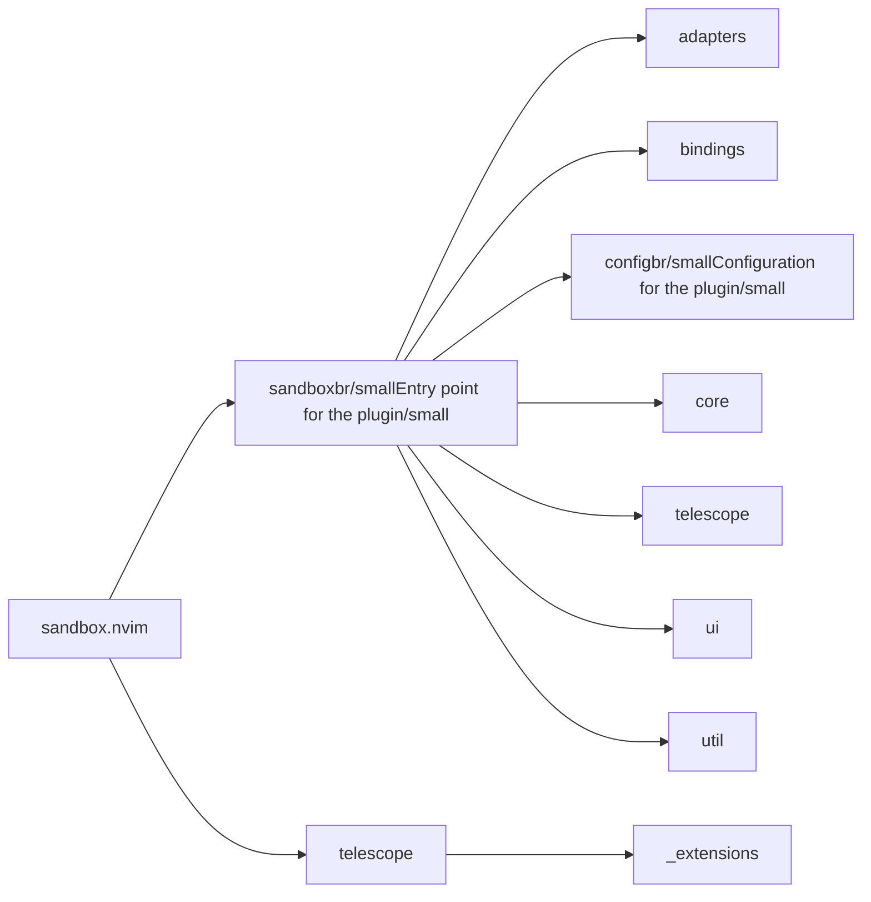
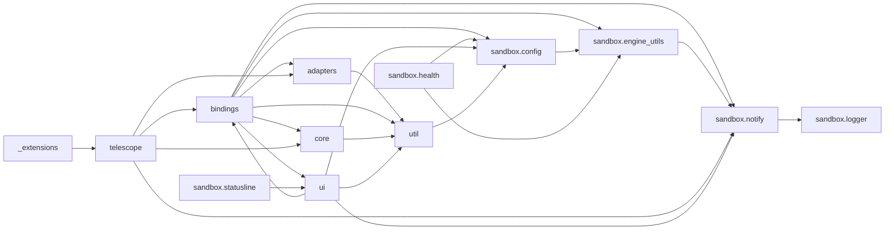

# sandbox.nvim — module map

> **Generated** by `documentation`. Do not edit by hand — run `:DocMap`
> (or `nvim --headless -l scripts/gen_map.lua`) to regenerate.

**3 modules** · 43 namespaces · 263 helper files

The [interactive map](index.html) has filtering, full descriptions and
source links; this page is the version the code host renders directly.

## Namespaces

## Dependencies

Which parts of the tree require which, rolled up to the second level.
The [interactive map](index.html)'s **Deps** view has this per module,
in both directions, with load-time and lazy requires told apart.

## Modules

| Module | Description | Fns | Docs |
|---|---|---|---|
| `sandbox` | Entry point for the plugin | 4 | [src](../../lua/sandbox/init.lua) |
| &nbsp;&nbsp;`adapters` |  |  |  |
| &nbsp;&nbsp;&nbsp;&nbsp;`docker` |  |  |  |
| &nbsp;&nbsp;&nbsp;&nbsp;&nbsp;&nbsp;`compose` |  |  |  |
| &nbsp;&nbsp;&nbsp;&nbsp;&nbsp;&nbsp;`containers` |  |  |  |
| &nbsp;&nbsp;&nbsp;&nbsp;&nbsp;&nbsp;`images` |  |  |  |
| &nbsp;&nbsp;&nbsp;&nbsp;&nbsp;&nbsp;`networks` |  |  |  |
| &nbsp;&nbsp;&nbsp;&nbsp;&nbsp;&nbsp;`registry` |  |  |  |
| &nbsp;&nbsp;&nbsp;&nbsp;&nbsp;&nbsp;`volumes` |  |  |  |
| &nbsp;&nbsp;&nbsp;&nbsp;`nerdctl` |  |  |  |
| &nbsp;&nbsp;&nbsp;&nbsp;&nbsp;&nbsp;`compose` |  |  |  |
| &nbsp;&nbsp;&nbsp;&nbsp;&nbsp;&nbsp;`containers` |  |  |  |
| &nbsp;&nbsp;&nbsp;&nbsp;&nbsp;&nbsp;`images` |  |  |  |
| &nbsp;&nbsp;&nbsp;&nbsp;&nbsp;&nbsp;`networks` |  |  |  |
| &nbsp;&nbsp;&nbsp;&nbsp;&nbsp;&nbsp;`registry` |  |  |  |
| &nbsp;&nbsp;&nbsp;&nbsp;&nbsp;&nbsp;`volumes` |  |  |  |
| &nbsp;&nbsp;&nbsp;&nbsp;`podman` |  |  |  |
| &nbsp;&nbsp;&nbsp;&nbsp;&nbsp;&nbsp;`compose` |  |  |  |
| &nbsp;&nbsp;&nbsp;&nbsp;&nbsp;&nbsp;`containers` |  |  |  |
| &nbsp;&nbsp;&nbsp;&nbsp;&nbsp;&nbsp;`images` |  |  |  |
| &nbsp;&nbsp;&nbsp;&nbsp;&nbsp;&nbsp;`networks` |  |  |  |
| &nbsp;&nbsp;&nbsp;&nbsp;&nbsp;&nbsp;`registry` |  |  |  |
| &nbsp;&nbsp;&nbsp;&nbsp;&nbsp;&nbsp;`volumes` |  |  |  |
| &nbsp;&nbsp;&nbsp;&nbsp;`wsl` |  |  |  |
| &nbsp;&nbsp;`bindings` |  |  |  |
| &nbsp;&nbsp;&nbsp;&nbsp;`autocmds` |  |  | [README](../../lua/sandbox/bindings/autocmds/README.md) |
| &nbsp;&nbsp;&nbsp;&nbsp;`keymaps` |  |  | [README](../../lua/sandbox/bindings/keymaps/README.md) |
| &nbsp;&nbsp;&nbsp;&nbsp;`sandbox.bindings.usrcmds` | lib.nvim.usercmd.composer verb with three sub-namespaces (container, image, and -- when wsl.exe is reachable -- wsl), e.g. | 14 | [src](../../lua/sandbox/bindings/usrcmds/init.lua) |
| &nbsp;&nbsp;`sandbox.config` | Configuration for the plugin | 1 | [src](../../lua/sandbox/config/init.lua) |
| &nbsp;&nbsp;`core` |  |  |  |
| &nbsp;&nbsp;&nbsp;&nbsp;`ports` |  |  |  |
| &nbsp;&nbsp;&nbsp;&nbsp;`usecases` |  |  |  |
| &nbsp;&nbsp;&nbsp;&nbsp;&nbsp;&nbsp;`compose` |  |  |  |
| &nbsp;&nbsp;&nbsp;&nbsp;&nbsp;&nbsp;`containers` |  |  |  |
| &nbsp;&nbsp;&nbsp;&nbsp;&nbsp;&nbsp;`devcontainer` |  |  |  |
| &nbsp;&nbsp;&nbsp;&nbsp;&nbsp;&nbsp;`images` |  |  |  |
| &nbsp;&nbsp;&nbsp;&nbsp;&nbsp;&nbsp;`networks` |  |  |  |
| &nbsp;&nbsp;&nbsp;&nbsp;&nbsp;&nbsp;`registry` |  |  |  |
| &nbsp;&nbsp;&nbsp;&nbsp;&nbsp;&nbsp;`volumes` |  |  |  |
| &nbsp;&nbsp;&nbsp;&nbsp;&nbsp;&nbsp;`wsl` |  |  |  |
| &nbsp;&nbsp;`telescope` |  |  |  |
| &nbsp;&nbsp;`ui` |  |  |  |
| &nbsp;&nbsp;`util` |  |  |  |
| `telescope` |  |  |  |
| &nbsp;&nbsp;`_extensions` |  |  |  |

## Drift

18 errors · 36 warnings · 150 info

| Severity | Check | Message |
|---|---|---|
| error | `missing-module-tag` | lua/sandbox/adapters/docker/containers/inspect_container.lua has no ---@module annotation |
| error | `missing-module-tag` | lua/sandbox/adapters/docker/images/inspect_image.lua has no ---@module annotation |
| error | `missing-module-tag` | lua/sandbox/adapters/docker/networks/inspect_network.lua has no ---@module annotation |
| error | `missing-module-tag` | lua/sandbox/adapters/docker/volumes/inspect_volume.lua has no ---@module annotation |
| error | `missing-module-tag` | lua/sandbox/adapters/nerdctl/containers/inspect_container.lua has no ---@module annotation |
| error | `missing-module-tag` | lua/sandbox/adapters/nerdctl/images/inspect_image.lua has no ---@module annotation |
| error | `missing-module-tag` | lua/sandbox/adapters/nerdctl/networks/inspect_network.lua has no ---@module annotation |
| error | `missing-module-tag` | lua/sandbox/adapters/nerdctl/volumes/inspect_volume.lua has no ---@module annotation |
| error | `missing-module-tag` | lua/sandbox/adapters/podman/containers/inspect_containers.lua has no ---@module annotation |
| error | `missing-module-tag` | lua/sandbox/adapters/podman/images/inspect_image.lua has no ---@module annotation |
| error | `missing-module-tag` | lua/sandbox/adapters/podman/networks/inspect_network.lua has no ---@module annotation |
| error | `missing-module-tag` | lua/sandbox/adapters/podman/volumes/inspect_volume.lua has no ---@module annotation |
| error | `missing-module-tag` | lua/sandbox/core/usecases/containers/inspect_container.lua has no ---@module annotation |
| error | `missing-module-tag` | lua/sandbox/core/usecases/images/inspect_image.lua has no ---@module annotation |
| error | `missing-module-tag` | lua/sandbox/core/usecases/networks/inspect_network.lua has no ---@module annotation |
| error | `missing-module-tag` | lua/sandbox/core/usecases/volumes/inspect_volume.lua has no ---@module annotation |
| error | `missing-module-tag` | lua/sandbox/ui/inspect_view.lua has no ---@module annotation |
| error | `module-path-mismatch` | lua/sandbox/core/usecases/wsl/start_distro.lua declares @module 'sandbox.core.usecases.wsl.start_distros' but lives at 'sandbox.core.usecases.wsl.start_distro' |
| warn | `missing-summary` | lua/sandbox/core/usecases/wsl/exec_in_distro.lua has no description line |
| warn | `missing-summary` | lua/sandbox/core/usecases/wsl/export_distro.lua has no description line |
| warn | `missing-summary` | lua/sandbox/core/usecases/wsl/import_distro.lua has no description line |
| warn | `missing-summary` | lua/sandbox/core/usecases/wsl/list_distros.lua has no description line |
| warn | `missing-summary` | lua/sandbox/core/usecases/wsl/set_default_distro.lua has no description line |
| warn | `missing-summary` | lua/sandbox/core/usecases/wsl/set_version_distro.lua has no description line |
| warn | `missing-summary` | lua/sandbox/core/usecases/wsl/shutdown_all.lua has no description line |
| warn | `missing-summary` | lua/sandbox/core/usecases/wsl/start_distro.lua has no description line |
| warn | `missing-summary` | lua/sandbox/core/usecases/wsl/stop_distro.lua has no description line |
| warn | `require-not-declared` | requires "sandbox.adapters.docker.containers.inspect_container" (line 22), which no file in this tree declares |
| warn | `require-not-declared` | requires "sandbox.adapters.docker.images.inspect_image" (line 16), which no file in this tree declares |
| warn | `require-not-declared` | requires "sandbox.adapters.docker.networks.inspect_network" (line 10), which no file in this tree declares |
| warn | `require-not-declared` | requires "sandbox.adapters.docker.volumes.inspect_volume" (line 10), which no file in this tree declares |
| warn | `require-not-declared` | requires "sandbox.adapters.nerdctl.containers.inspect_container" (line 22), which no file in this tree declares |
| warn | `require-not-declared` | requires "sandbox.adapters.nerdctl.images.inspect_image" (line 16), which no file in this tree declares |
| warn | `require-not-declared` | requires "sandbox.adapters.nerdctl.networks.inspect_network" (line 10), which no file in this tree declares |
| warn | `require-not-declared` | requires "sandbox.adapters.nerdctl.volumes.inspect_volume" (line 10), which no file in this tree declares |
| warn | `require-not-declared` | requires "sandbox.adapters.podman.containers.inspect_containers" (line 22), which no file in this tree declares |
| warn | `require-not-declared` | requires "sandbox.adapters.podman.images.inspect_image" (line 16), which no file in this tree declares |
| warn | `require-not-declared` | requires "sandbox.adapters.podman.networks.inspect_network" (line 10), which no file in this tree declares |
| warn | `require-not-declared` | requires "sandbox.adapters.podman.volumes.inspect_volume" (line 10), which no file in this tree declares |
| warn | `require-not-declared` | requires "sandbox.ui.inspect_view" (line 482), which no file in this tree declares |
| warn | `require-not-declared` | requires "sandbox.core.usecases.containers.inspect_container" (line 481), which no file in this tree declares |
| warn | `require-not-declared` | requires "sandbox.ui.inspect_view" (line 244), which no file in this tree declares |
| warn | `require-not-declared` | requires "sandbox.core.usecases.images.inspect_image" (line 243), which no file in this tree declares |
| warn | `require-not-declared` | requires "sandbox.core.usecases.networks.inspect_network" (line 100), which no file in this tree declares |
| warn | `require-not-declared` | requires "sandbox.ui.inspect_view" (line 101), which no file in this tree declares |
| warn | `require-not-declared` | requires "sandbox.ui.inspect_view" (line 99), which no file in this tree declares |
| warn | `require-not-declared` | requires "sandbox.core.usecases.volumes.inspect_volume" (line 98), which no file in this tree declares |
| warn | `require-not-declared` | requires "sandbox.core.usecases.wsl.start_distro" (line 68), which no file in this tree declares |
| warn | `require-not-declared` | requires "telescope.actions.state" (line 36), which no file in this tree declares |
| warn | `require-not-declared` | requires "telescope.actions" (line 35), which no file in this tree declares |
| warn | `require-not-declared` | requires "telescope.config" (line 34), which no file in this tree declares |
| warn | `require-not-declared` | requires "telescope.finders" (line 33), which no file in this tree declares |
| warn | `require-not-declared` | requires "telescope.pickers" (line 32), which no file in this tree declares |
| warn | `require-not-declared` | requires "telescope" (line 9), which no file in this tree declares |

150 informational findings

| Check | Message |
|---|---|
| `missing-readme` | lua/sandbox has no README.md |
| `missing-readme` | lua/sandbox/bindings/usrcmds has no README.md |
| `missing-readme` | lua/sandbox/config has no README.md |
| `undocumented-param` | M.setup has 1 parameter(s) but only 0 @param line(s) |
| `undocumented-param` | M.down has 2 parameter(s) but only 0 @param line(s) |
| `undocumented-param` | M.logs has 1 parameter(s) but only 0 @param line(s) |
| `undocumented-param` | M.ps has 1 parameter(s) but only 0 @param line(s) |
| `undocumented-param` | M.restart has 2 parameter(s) but only 0 @param line(s) |
| `undocumented-param` | M.up has 2 parameter(s) but only 0 @param line(s) |
| `undocumented-param` | M.cp_container has 2 parameter(s) but only 0 @param line(s) |
| `undocumented-param` | M.exec_in_container has 2 parameter(s) but only 0 @param line(s) |
| `undocumented-param` | M.follow_logs has 3 parameter(s) but only 0 @param line(s) |
| `undocumented-param` | M.get_logs has 1 parameter(s) but only 0 @param line(s) |
| `undocumented-param` | M.inspect_container has 1 parameter(s) but only 0 @param line(s) |
| `undocumented-param` | M.kill_container has 2 parameter(s) but only 0 @param line(s) |
| `undocumented-param` | M.unpause_container has 2 parameter(s) but only 0 @param line(s) |
| `undocumented-param` | M.pause_container has 2 parameter(s) but only 0 @param line(s) |
| `undocumented-param` | M.prune_containers has 1 parameter(s) but only 0 @param line(s) |
| `undocumented-param` | M.remove_container has 2 parameter(s) but only 0 @param line(s) |
| `undocumented-param` | M.rename_container has 2 parameter(s) but only 0 @param line(s) |
| `undocumented-param` | M.restart_container has 2 parameter(s) but only 0 @param line(s) |
| `undocumented-param` | M.run_container has 2 parameter(s) but only 0 @param line(s) |
| `undocumented-param` | M.start_container has 1 parameter(s) but only 0 @param line(s) |
| `undocumented-param` | M.stats_container has 1 parameter(s) but only 0 @param line(s) |
| `undocumented-param` | M.stop_container has 2 parameter(s) but only 0 @param line(s) |
| `undocumented-param` | M.top_container has 1 parameter(s) but only 0 @param line(s) |
| `undocumented-param` | M.history_image has 1 parameter(s) but only 0 @param line(s) |
| `undocumented-param` | M.inspect_image has 1 parameter(s) but only 0 @param line(s) |
| `undocumented-param` | M.load_image has 1 parameter(s) but only 0 @param line(s) |
| `undocumented-param` | M.prune_images has 1 parameter(s) but only 0 @param line(s) |
| `undocumented-param` | M.pull_image has 2 parameter(s) but only 0 @param line(s) |
| `undocumented-param` | M.push_image has 2 parameter(s) but only 0 @param line(s) |
| `undocumented-param` | M.remove_image has 2 parameter(s) but only 0 @param line(s) |
| `undocumented-param` | M.save_image has 2 parameter(s) but only 0 @param line(s) |
| `undocumented-param` | M.tag_image has 2 parameter(s) but only 0 @param line(s) |
| `undocumented-param` | M.connect_network has 2 parameter(s) but only 0 @param line(s) |
| `undocumented-param` | M.disconnect_network has 2 parameter(s) but only 0 @param line(s) |
| `undocumented-param` | M.create_network has 1 parameter(s) but only 0 @param line(s) |
| `undocumented-param` | M.inspect_network has 1 parameter(s) but only 0 @param line(s) |
| `undocumented-param` | M.prune_networks has 1 parameter(s) but only 0 @param line(s) |
| `undocumented-param` | M.remove_network has 2 parameter(s) but only 0 @param line(s) |
| `undocumented-param` | M.login has 3 parameter(s) but only 0 @param line(s) |
| `undocumented-param` | M.logout has 1 parameter(s) but only 0 @param line(s) |
| `undocumented-param` | M.create_volume has 1 parameter(s) but only 0 @param line(s) |
| `undocumented-param` | M.inspect_volume has 1 parameter(s) but only 0 @param line(s) |
| `undocumented-param` | M.prune_volumes has 1 parameter(s) but only 0 @param line(s) |
| `undocumented-param` | M.remove_volume has 2 parameter(s) but only 0 @param line(s) |
| `undocumented-param` | M.down has 2 parameter(s) but only 0 @param line(s) |
| `undocumented-param` | M.logs has 1 parameter(s) but only 0 @param line(s) |
| `undocumented-param` | M.ps has 1 parameter(s) but only 0 @param line(s) |
| `undocumented-param` | M.restart has 2 parameter(s) but only 0 @param line(s) |
| `undocumented-param` | M.up has 2 parameter(s) but only 0 @param line(s) |
| `undocumented-param` | M.cp_container has 2 parameter(s) but only 0 @param line(s) |
| `undocumented-param` | M.exec_in_container has 2 parameter(s) but only 0 @param line(s) |
| `undocumented-param` | M.follow_logs has 3 parameter(s) but only 0 @param line(s) |
| `undocumented-param` | M.get_logs has 1 parameter(s) but only 0 @param line(s) |
| `undocumented-param` | M.inspect_container has 1 parameter(s) but only 0 @param line(s) |
| `undocumented-param` | M.kill_container has 2 parameter(s) but only 0 @param line(s) |
| `undocumented-param` | M.pause_container has 2 parameter(s) but only 0 @param line(s) |
| `undocumented-param` | M.unpause_container has 2 parameter(s) but only 0 @param line(s) |
| `undocumented-param` | M.prune_containers has 1 parameter(s) but only 0 @param line(s) |
| `undocumented-param` | M.remove_container has 2 parameter(s) but only 0 @param line(s) |
| `undocumented-param` | M.rename_container has 2 parameter(s) but only 0 @param line(s) |
| `undocumented-param` | M.restart_container has 2 parameter(s) but only 0 @param line(s) |
| `undocumented-param` | M.run_container has 2 parameter(s) but only 0 @param line(s) |
| `undocumented-param` | M.start_container has 1 parameter(s) but only 0 @param line(s) |
| `undocumented-param` | M.stats_container has 1 parameter(s) but only 0 @param line(s) |
| `undocumented-param` | M.stop_container has 2 parameter(s) but only 0 @param line(s) |
| `undocumented-param` | M.top_container has 1 parameter(s) but only 0 @param line(s) |
| `undocumented-param` | M.history_image has 1 parameter(s) but only 0 @param line(s) |
| `undocumented-param` | M.inspect_image has 1 parameter(s) but only 0 @param line(s) |
| `undocumented-param` | M.load_image has 1 parameter(s) but only 0 @param line(s) |
| `undocumented-param` | M.prune_images has 1 parameter(s) but only 0 @param line(s) |
| `undocumented-param` | M.pull_image has 2 parameter(s) but only 0 @param line(s) |
| `undocumented-param` | M.push_image has 2 parameter(s) but only 0 @param line(s) |
| `undocumented-param` | M.remove_image has 2 parameter(s) but only 0 @param line(s) |
| `undocumented-param` | M.save_image has 2 parameter(s) but only 0 @param line(s) |
| `undocumented-param` | M.tag_image has 2 parameter(s) but only 0 @param line(s) |
| `undocumented-param` | M.disconnect_network has 2 parameter(s) but only 0 @param line(s) |
| `undocumented-param` | M.connect_network has 2 parameter(s) but only 0 @param line(s) |
| `undocumented-param` | M.create_network has 1 parameter(s) but only 0 @param line(s) |
| `undocumented-param` | M.inspect_network has 1 parameter(s) but only 0 @param line(s) |
| `undocumented-param` | M.prune_networks has 1 parameter(s) but only 0 @param line(s) |
| `undocumented-param` | M.remove_network has 2 parameter(s) but only 0 @param line(s) |
| `undocumented-param` | M.login has 3 parameter(s) but only 0 @param line(s) |
| `undocumented-param` | M.logout has 1 parameter(s) but only 0 @param line(s) |
| `undocumented-param` | M.create_volume has 1 parameter(s) but only 0 @param line(s) |
| `undocumented-param` | M.inspect_volume has 1 parameter(s) but only 0 @param line(s) |
| `undocumented-param` | M.prune_volumes has 1 parameter(s) but only 0 @param line(s) |
| `undocumented-param` | M.remove_volume has 2 parameter(s) but only 0 @param line(s) |
| `undocumented-param` | M.down has 2 parameter(s) but only 0 @param line(s) |
| `undocumented-param` | M.logs has 1 parameter(s) but only 0 @param line(s) |
| `undocumented-param` | M.ps has 1 parameter(s) but only 0 @param line(s) |
| `undocumented-param` | M.restart has 2 parameter(s) but only 0 @param line(s) |
| `undocumented-param` | M.up has 2 parameter(s) but only 0 @param line(s) |
| `undocumented-param` | M.cp_container has 2 parameter(s) but only 0 @param line(s) |
| `undocumented-param` | M.exec_in_container has 2 parameter(s) but only 0 @param line(s) |
| `undocumented-param` | M.follow_logs has 3 parameter(s) but only 0 @param line(s) |
| `undocumented-param` | M.get_logs has 1 parameter(s) but only 0 @param line(s) |
| `undocumented-param` | M.inspect_container has 1 parameter(s) but only 0 @param line(s) |
| `undocumented-param` | M.kill_container has 2 parameter(s) but only 0 @param line(s) |
| `undocumented-param` | M.unpause_container has 2 parameter(s) but only 0 @param line(s) |
| `undocumented-param` | M.pause_container has 2 parameter(s) but only 0 @param line(s) |
| `undocumented-param` | M.prune_containers has 1 parameter(s) but only 0 @param line(s) |
| `undocumented-param` | M.remove_container has 2 parameter(s) but only 0 @param line(s) |
| `undocumented-param` | M.rename_container has 2 parameter(s) but only 0 @param line(s) |
| `undocumented-param` | M.restart_container has 2 parameter(s) but only 0 @param line(s) |
| `undocumented-param` | M.run_container has 2 parameter(s) but only 0 @param line(s) |
| `undocumented-param` | M.start_container has 1 parameter(s) but only 0 @param line(s) |
| `undocumented-param` | M.stats_container has 1 parameter(s) but only 0 @param line(s) |
| `undocumented-param` | M.stop_container has 2 parameter(s) but only 0 @param line(s) |
| `undocumented-param` | M.top_container has 1 parameter(s) but only 0 @param line(s) |
| `undocumented-param` | M.history_image has 1 parameter(s) but only 0 @param line(s) |
| `undocumented-param` | M.inspect_image has 1 parameter(s) but only 0 @param line(s) |
| `undocumented-param` | M.load_image has 1 parameter(s) but only 0 @param line(s) |
| `undocumented-param` | M.prune_images has 1 parameter(s) but only 0 @param line(s) |
| `undocumented-param` | M.pull_image has 2 parameter(s) but only 0 @param line(s) |
| `undocumented-param` | M.push_image has 2 parameter(s) but only 0 @param line(s) |
| `undocumented-param` | M.remove_image has 2 parameter(s) but only 0 @param line(s) |
| `undocumented-param` | M.save_image has 2 parameter(s) but only 0 @param line(s) |
| `undocumented-param` | M.tag_image has 2 parameter(s) but only 0 @param line(s) |
| `undocumented-param` | M.connect_network has 2 parameter(s) but only 0 @param line(s) |
| `undocumented-param` | M.disconnect_network has 2 parameter(s) but only 0 @param line(s) |
| `undocumented-param` | M.create_network has 1 parameter(s) but only 0 @param line(s) |
| `undocumented-param` | M.inspect_network has 1 parameter(s) but only 0 @param line(s) |
| `undocumented-param` | M.prune_networks has 1 parameter(s) but only 0 @param line(s) |
| `undocumented-param` | M.remove_network has 2 parameter(s) but only 0 @param line(s) |
| `undocumented-param` | M.login has 3 parameter(s) but only 0 @param line(s) |
| `undocumented-param` | M.logout has 1 parameter(s) but only 0 @param line(s) |
| `undocumented-param` | M.create_volume has 1 parameter(s) but only 0 @param line(s) |
| `undocumented-param` | M.inspect_volume has 1 parameter(s) but only 0 @param line(s) |
| `undocumented-param` | M.prune_volumes has 1 parameter(s) but only 0 @param line(s) |
| `undocumented-param` | M.remove_volume has 2 parameter(s) but only 0 @param line(s) |
| `undocumented-param` | M.setup has 1 parameter(s) but only 0 @param line(s) |
| `undocumented-param` | M.is_executable has 1 parameter(s) but only 0 @param line(s) |
| `undocumented-param` | M.info has 1 parameter(s) but only 0 @param line(s) |
| `undocumented-param` | M.error has 2 parameter(s) but only 0 @param line(s) |
| `undocumented-param` | M.warn has 2 parameter(s) but only 0 @param line(s) |
| `undocumented-param` | M.destructive has 2 parameter(s) but only 0 @param line(s) |
| `undocumented-param` | M.parse has 1 parameter(s) but only 0 @param line(s) |
| `undocumented-param` | M.workspace_dir has 1 parameter(s) but only 0 @param line(s) |
| `undocumented-param` | M.run_async_captured has 2 parameter(s) but only 0 @param line(s) |
| `unreferenced-module` | sandbox.bindings.usrcmds is required by no other file in the tree |
| `unreferenced-module` | sandbox.core.ports.compose_engine is required by no other file in the tree |
| `unreferenced-module` | sandbox.core.ports.container_engine is required by no other file in the tree |
| `unreferenced-module` | sandbox.core.ports.wsl_engine is required by no other file in the tree |
| `unreferenced-module` | sandbox.core.usecases.wsl.start_distros is required by no other file in the tree |
| `unreferenced-module` | sandbox.health is required by no other file in the tree |
| `unreferenced-module` | sandbox.statusline is required by no other file in the tree |
| `unreferenced-module` | telescope._extensions.sandbox is required by no other file in the tree |

